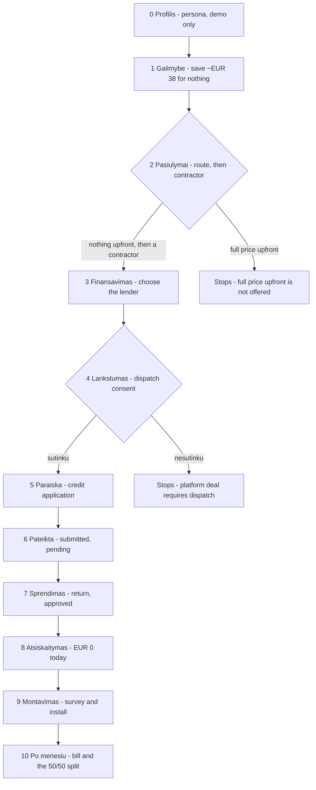
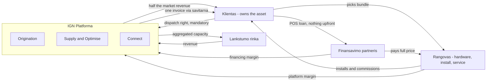

# Platform demo — customer flow through the contractor variant

**What it is:** a clickable mockup of the end-customer journey through the Ignitis platform, in the
operating model described on slide 8 of *Residential BESS Operating Models* — the independent
platform/orchestrator, contractor variant.

**Audience:** innovation unit and group commercial, same room as the household flexibility mockup.

**Language:** the demo itself runs in Lithuanian by default, with an LT/EN toggle in the top bar.
This document is in English because it sits alongside
[flexibility-origination-decision-map.md](flexibility-origination-decision-map.md).

---

## What the demo argues

Slide 8 is the source of truth. Ignitis owns origination, supply, connect and optimise. Selected
contractors on the platform carry hardware, install and service as a single bundle. Selected
financing partners on the platform carry a point-of-sale loan. The customer owns the asset from day
one. Ignitis takes **no hardware margin** and has **no financial exposure**, earning platform margin
off the contractor and financing margins plus a share of optimisation revenue.

> A household gets a battery and solar installed for nothing upfront, experiences it as one coherent
> Ignitis product, and Ignitis funded no part of it.

### How this differs from the household flexibility mockup

| | Household mockup (`index.html`) | Platform demo (`platform.html`) |
| --- | --- | --- |
| Asset owner | Ignitis, in the lead variant | The customer, always |
| Capital | Ignitis balance sheet | Financing partner, POS loan |
| Install | Implied Ignitis ON | Contractor chosen by the customer |
| Ignitis revenue | Service fee + dispatch right | Platform margin + optimisation share |
| Question it asks | Will a household say yes? | Can we assemble a deal we fund no part of? |

The two sit on opposite sides of fork 1 in the decision map. Shown together they bracket the
ownership question rather than answering it.

---

## Decisions locked before the build

| Decision | Resolution |
| --- | --- |
| Whose screens | End customer only. Contractors and financiers appear as choices, not consoles. |
| Language | Lithuanian default, LT/EN toggle, whole surface translates |
| How you buy | Two routes shown, one offered. Nothing-upfront is choosable; full-price-upfront is priced for comparison and disabled |
| Hardware comparison | Contractors quote their **own** bundles; the platform normalises to monthly cost and estimated annual benefit |
| Financing | Point-of-sale loan, zero upfront, fixed at ten years. The customer chooses the **lender**, not the term |
| Dispatch control | **Mandatory**, and battery-only. The EV is context for the high consumption, never operated by Ignitis |
| Flexibility revenue | No guaranteed floor. Market revenue split 50/50, with the average monthly value stated alongside |
| Credit approval | Explicit application with a demo-autofill button, then a submitted-and-pending status, then a time break before the decision |
| Economics | Illustrative throughout. Baseline anchored on slide 5 so the figures hang together |
| Presenter layer | None. This is the customer's screen and nothing else |

---

## Screen flow

Both gates are real. On screen 2 the contractor cards do not exist until a route is chosen, and the
continue button stays disabled until both the route and a contractor are picked. On screen 4
declining renders a dead-end panel rather than silently letting the flow continue.

## Who carries what

Ignitis appears in no money flow that requires it to put capital in. That is the whole point of the
variant, and it is also why the residual-value test in the decision map is failed deliberately.

---

## Key elements per screen

### 0 · Profilis
*The only screen the customer never sees. Read it out before starting.*

- Persona card: name, age, detached house, household size, weekday occupancy.
- Four facts and nothing else: 7,000 kWh/yr, around €140/month average bill, an air-to-water heat
  pump, and an EV charged at home in the evening. No solar and no battery — their absence is the
  premise, so it is not spelled out as a cell.

### 1 · Galimybė
*The hero. An outcome, not a product.*

- Headline: save around €38 a month without spending a single euro. The figure derives from the best
  financed quote in the model, so it stays true if the bundles are retuned.
- The mechanism in the lede: a partner pays for the equipment, Ignitis operates the battery and
  splits what it earns, and that share is what takes the monthly figure below the current bill.
- Three figures: €0 today, the monthly saving, who owns the asset.
- Three-role strip naming the parties: contractor installs, financing partner pays, Ignitis operates
  and shares the value.

### 2 · Pasiūlymai
*The marketplace. The screen that carries the contractor variant's argument.*

- Suggested sizing header: our recommended optimal size for this profile, derived from the household's
  own consumption rather than a catalogue.
- Two approach cards. **Pay nothing upfront** with its expected monthly saving is choosable;
  **optimal saving, full price upfront** is priced honestly and disabled, because the platform does
  not offer that route. Clicking it does nothing by design.
- Choosing the financed route reveals four contractor cards, each quoting **its own hardware**:
  differing PV kW, inverter, battery kWh, price, lead time, warranty, rating and service response.
- Two normalised figures per card in a fixed position: monthly cost and estimated annual benefit.
- A two-tile hardware strip per bundle — the array and the battery, which is all the contractor
  supplies. The full specification stays in the list below it.
> The teaching point: the cheapest hardware is **not** the cheapest monthly cost. A bigger battery
> earns a larger average flexibility value, so the most expensive bundle has the lowest net monthly
> figure. Normalisation is the platform's actual product here.

### 3 · Finansavimas
*The chosen bundle and the money.*

- Selected bundle summary with a route back to the marketplace.
- Lender selector: three financing partners, all over ten years with zero upfront, instalment and
  total recalculating live. What differs is the rate and the decision speed, not the cash-flow shape.
- Monthly breakdown: electricity, instalment, export income, average flexibility value, the total,
  the current bill, and the difference between them as its own band at the foot.

### 4 · Lankstumas
*The mandatory gate.*

- What Ignitis controls — the battery only, never the car — and the reserve the customer always keeps.
- The revenue share stated as a percentage split, with the average monthly value alongside and an
  explicit note that a good month pays more and a quiet one less.
- A required choice. Declining renders a dead-end panel quantifying what the share is worth, and
  pointing out that buying the system unaided stays entirely open.
- Honest panel: the customer owns the hardware and is not locked into Ignitis supply — but leaving
  ends the optimisation and the share.

### 5 · Paraiška
*The credit application, and the last step on the customer's side.*

- The chosen financing provider named in the eyebrow, the headline and the lede.
- Realistic fields: name, personal code, net monthly income, employment, existing obligations,
  household size, contact.
- A prominent button that fills the form with demo data, so nobody types during a live session.
- Submission makes clear the data goes to the named financing partner, not to Ignitis.

### 6 · Pateikta
*Submitted and pending. The screen that stops the silence being a dead zone.*

- Amber status panel: under review, with the amount, term, rate and instalment as submitted.
- The deal restated in full — contractor and system, lender and instalment, Ignitis supply and
  flexibility share, and the monthly total if approved against the current bill.
- A decision within two working days, notified by email, with nothing to do in the meantime.

### 7 · Sprendimas
*The time break. The structural beat the first mockup does not have.*

- Visible elapsed time: the customer returns two working days later.
- A light re-entry moment rather than a working login.
- Decision panel: approved as requested — amount, term, rate, instalment, lender.
- A counter-offer or rejection branch was deliberately not built. Three lenders exist partly so the
  branch is obvious even though it is not shown.

### 8 · Atsiskaitymas
*Checkout where nothing is paid.*

- A three-role panel stating plainly who does what: the contractor supplies and installs the
  equipment, the financing partner finances the customer, and Ignitis supplies the electricity and
  creates the flexibility value.
- A callout that **all payments are routed automatically through Ignitis savitarna** — one debit, one
  login, with the split to each party visible inside it.
- **€0.00 due today** as the headline figure.
- Order summary: bundle, contractor, financing partner, average flexibility value.
- Three agreements listed separately: install and equipment contract with the contractor, consumer
  credit agreement with the financing partner, flexibility and supply agreement with Ignitis.
- The monthly figure confirmed against the current bill.
- Withdrawal rights and the subject-to-survey caveat.

### 9 · Montavimas
*The gap between signing and a working asset.*

- Timeline: survey, install window, commissioning, grid permission, connection to the platform.
- The first invoice described as one savitarna invoice carrying the electricity, the named lender's
  instalment and the customer's share of the flexibility revenue.
- A named contractor contact, not an Ignitis call centre.
- The quote is explicitly subject to the survey, and what happens if it changes.
- Subsidy note: the customer owns the asset, so any support goes to the customer — which is the one
  thing this model does better than the Ignitis-financed route on slide 6.

### 10 · Po mėnesių
*The relationship screen.*

- Illustrative invoice with the instalment, electricity, export credit and the customer's half of the
  flexibility revenue as separate lines, with the gross figure named next to the share.
- Operating summary: nights charged, dispatch events, reserve untouched, outage ridden through.
- A good month set against a named quiet month: January earned far less and the customer still got
  half of it. The split never changes; the amount does. That is what distinguishes a share from a
  promise, and it is why no floor is claimed anywhere in the flow.

---

## Mapping back to slide 8

| Slide 8 element | Where it appears in the demo |
| --- | --- |
| Ignitis owns origination | Screen 1. The customer arrives through Ignitis and is already its customer |
| Selected contractors on platform | Screen 2, four vetted bundles with quality signals |
| Selected financing partners on platform | Screen 3, three lenders at a fixed term; screens 5 and 6, the application goes to the chosen one |
| Customer owns asset | Screens 1, 4, 8 and 9 state it explicitly |
| POS loan, 10 year, x% upfront | Screens 2 and 3, with x = 0 |
| Ignitis owns connect, supply, optimise | Screens 4, 8 and 10 |
| Platform margin + optimisation share | The optimisation share is on screens 4, 8 and 10 as the 50/50 split. The platform margin off the contractor and lender is not shown to the customer by design |
| No hardware margin for Ignitis | Visible by absence: price is the contractor's, not ours |
| No customer lock-in for supply | Screen 4's honest panel |
| Platform only serves Ignitis customers | Screen 4's honest panel, as the limitation it is |

---

## What the demo deliberately does not do

- No presenter overlay, no strategy panel, no four-tests read on screen.
- No contractor, financing partner or Ignitis operations views.
- No metering-consent screen. It existed in the first cut and was cut: it is a real barrier in
  production, but in a demo it delayed the offer without changing anyone's mind about the model.
- No working full-price-upfront route. It is priced on screen 2 and deliberately unavailable.
- No rejection or counter-offer branch on the credit decision.
- No real credit logic, no real contractor data, no committed economics. One contractor name is
  taken from a real company at the request of the brief; the rest are invented, and none of the
  quoted figures are theirs.
