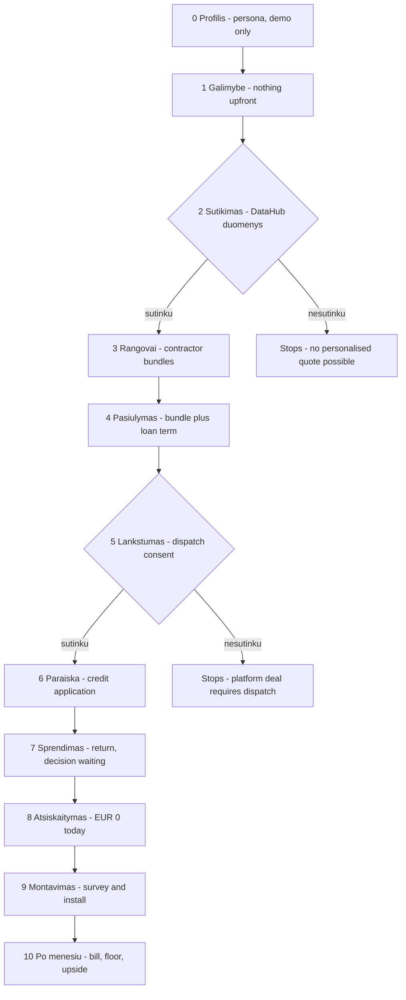
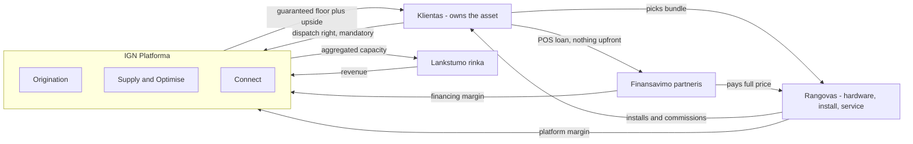

# Platform demo — customer flow through the contractor variant

**What it is:** a clickable mockup of the end-customer journey through the Ignitis platform, in the
operating model described on slide 8 of *Residential BESS Operating Models* — the independent
platform/orchestrator, contractor variant.

**Audience:** innovation unit and group commercial, same room as the household flexibility mockup.

**Language:** the demo itself runs in Lithuanian by default, with an LT/EN toggle in the top bar.
This document is in English because it sits alongside
[flexibility-origination-decision-map.md](flexibility-origination-decision-map.md).

---

## What the demo argues

Slide 8 is the source of truth. Ignitis owns origination, supply, connect and optimise. Selected
contractors on the platform carry hardware, install and service as a single bundle. Selected
financing partners on the platform carry a point-of-sale loan. The customer owns the asset from day
one. Ignitis takes **no hardware margin** and has **no financial exposure**, earning platform margin
off the contractor and financing margins plus a share of optimisation revenue.

> A household gets a battery and solar installed for nothing upfront, experiences it as one coherent
> Ignitis product, and Ignitis funded no part of it.

### How this differs from the household flexibility mockup

| | Household mockup (`index.html`) | Platform demo (`platform.html`) |
| --- | --- | --- |
| Asset owner | Ignitis, in the lead variant | The customer, always |
| Capital | Ignitis balance sheet | Financing partner, POS loan |
| Install | Implied Ignitis ON | Contractor chosen by the customer |
| Ignitis revenue | Service fee + dispatch right | Platform margin + optimisation share |
| Question it asks | Will a household say yes? | Can we assemble a deal we fund no part of? |

The two sit on opposite sides of fork 1 in the decision map. Shown together they bracket the
ownership question rather than answering it.

---

## Decisions locked before the build

| Decision | Resolution |
| --- | --- |
| Whose screens | End customer only. Contractors and financiers appear as choices, not consoles. |
| Language | Lithuanian default, LT/EN toggle, whole surface translates |
| Hardware comparison | Contractors quote their **own** bundles; the platform normalises to monthly cost and estimated annual benefit |
| Financing | Point-of-sale loan, zero upfront, 5 / 10 / 15 year terms |
| Dispatch control | **Mandatory.** Decline it and there is no platform offer |
| Flexibility revenue | Guaranteed monthly floor netted off the instalment, upside shared 50/50 above it |
| Credit approval | Explicit application with a demo-autofill button, then a time break before the decision |
| Economics | Illustrative throughout. Baseline anchored on slide 5 so the figures hang together |
| Presenter layer | None. This is the customer's screen and nothing else |

---

## Screen flow

Both gates are real. The continue button is disabled until the switch is on, and screen 5 renders a
dead-end panel rather than silently letting the flow continue.

## Who carries what

Ignitis appears in no money flow that requires it to put capital in. That is the whole point of the
variant, and it is also why the residual-value test in the decision map is failed deliberately.

---

## Key elements per screen

### 0 · Profilis
*The only screen the customer never sees. Read it out before starting.*

- Persona card: name, age, detached house, household size, weekday occupancy.
- Fact grid: 10,000 kWh/yr, air-to-water heat pump, electric water heating, no solar, no battery,
  no EV, current cost around €200/month.
- Callout establishing that for this household the upfront cost is the binding constraint, not the
  payback period.

### 1 · Galimybė
*The hero. An outcome, not a product.*

- Headline: solar and a battery, nothing upfront.
- Three figures: €0 today, the monthly change, who actually pays for the hardware.
- Three-role strip naming the parties: contractor installs, financing partner pays, Ignitis operates
  and settles on one invoice.

### 2 · Sutikimas
*The data gate. A working switch, deliberately not skippable.*

- One switch: 24 months of 15-minute DataHub data plus tariff and network zone.
- What is **not** read, and that it can be withdrawn.
- Why it matters: without it, every contractor on the platform would need a site visit before
  quoting anything.

### 3 · Rangovai
*The marketplace. The screen that carries the contractor variant's argument.*

- Derived sizing header: what the household's own data suggests it needs.
- Four contractor cards, each quoting **its own hardware**: differing PV kW, inverter, battery kWh,
  price, lead time, warranty, rating and service response.
- Two normalised figures per card in a fixed position: monthly cost and estimated annual benefit.
- Hardware icon strip per bundle, reusing the `kitStrip` pattern from the household mockup.
- An honest line per card naming its weakest point.

> The teaching point: the cheapest hardware is **not** the cheapest monthly cost. A bigger battery
> earns a bigger flexibility floor, so the most expensive bundle has the lowest net monthly figure.
> Normalisation is the platform's actual product here.

### 4 · Pasiūlymas
*The chosen bundle and the money.*

- Selected bundle summary with a route back to the marketplace.
- Term selector: 5 / 10 / 15 years, zero upfront on all three, instalment recalculating live.
- The financing partner named per term, because the platform picks the best offer per term.
- Before/after monthly breakdown: electricity, instalment, export income, flexibility floor.
- Caveat that a 15-year term outlives the battery warranty.

### 5 · Lankstumas
*The mandatory gate.*

- What Ignitis controls, and the reserve the customer always keeps.
- The guaranteed floor as a named monthly figure, and the 50/50 split above it.
- A required switch. Declining renders a dead-end panel: the platform offer does not exist without
  dispatch, and the customer's alternative is to buy the system at market price unaided.
- Honest panel: the customer owns the hardware and is not locked into Ignitis supply — but leaving
  ends the optimisation and the income.

### 6 · Paraiška
*The credit application.*

- Realistic fields: name, personal code, net monthly income, employment, existing obligations,
  household size, contact.
- A prominent button that fills the form with demo data, so nobody types during a live session.
- Submission makes clear the data goes to the named financing partner, not to Ignitis.

### 7 · Sprendimas
*The time break. The structural beat the first mockup does not have.*

- Visible elapsed time: the customer returns two working days later.
- A light re-entry moment rather than a working login.
- Decision panel: approved as requested — amount, term, rate, instalment, partner.
- A counter-offer or rejection branch was deliberately not built.

### 8 · Atsiskaitymas
*Checkout where nothing is paid.*

- Order summary: bundle, contractor, financing partner, term.
- **€0.00 due today** as the headline of the screen.
- Three agreements listed separately: install and equipment contract with the contractor, consumer
  credit agreement with the financing partner, flexibility and supply agreement with Ignitis.
- The monthly figure confirmed against the current bill.
- Withdrawal rights and the subject-to-survey caveat.

### 9 · Montavimas
*The gap between signing and a working asset.*

- Timeline: survey, install window, commissioning, grid permission, connection to the platform,
  asset joins the aggregation pool.
- A named contractor contact, not an Ignitis call centre.
- The quote is explicitly subject to the survey, and what happens if it changes.
- Subsidy note: the customer owns the asset, so any support goes to the customer — which is the one
  thing this model does better than the Ignitis-financed route on slide 6.

### 10 · Po mėnesių
*The relationship screen.*

- Illustrative invoice with the instalment, electricity, export credit, guaranteed floor and upside
  share as separate lines.
- Operating summary: nights charged, dispatch events, reserve untouched, outage ridden through.
- Pool status: this asset is one of N, against the ~1 MW prequalification threshold.
- A month where the floor paid out more than the market earned, so the floor is visibly doing work.

---

## Mapping back to slide 8

| Slide 8 element | Where it appears in the demo |
| --- | --- |
| Ignitis owns origination | Screens 1–2. The customer arrives through Ignitis and consents to Ignitis |
| Selected contractors on platform | Screen 3, four vetted bundles with quality signals |
| Selected financing partners on platform | Screen 4, best offer per term; screen 6, application goes to the partner |
| Customer owns asset | Screens 5, 8 and 9 state it explicitly |
| POS loan, 5/10/15 year, x% upfront | Screen 4, with x = 0 |
| Ignitis owns connect, supply, optimise | Screens 5 and 10 |
| Platform margin + optimisation share | Not shown to the customer by design. Lives in this document |
| No hardware margin for Ignitis | Visible by absence: price is the contractor's, not ours |
| No customer lock-in for supply | Screen 5's honest panel |
| Platform only serves Ignitis customers | Screen 5's honest panel, as the limitation it is |

---

## What the demo deliberately does not do

- No presenter overlay, no strategy panel, no four-tests read on screen.
- No contractor, financing partner or Ignitis operations views.
- No rejection or counter-offer branch on the credit decision.
- No real credit logic, no real contractor data, no committed economics. One contractor name is
  taken from a real company at the request of the brief; the rest are invented, and none of the
  quoted figures are theirs.
